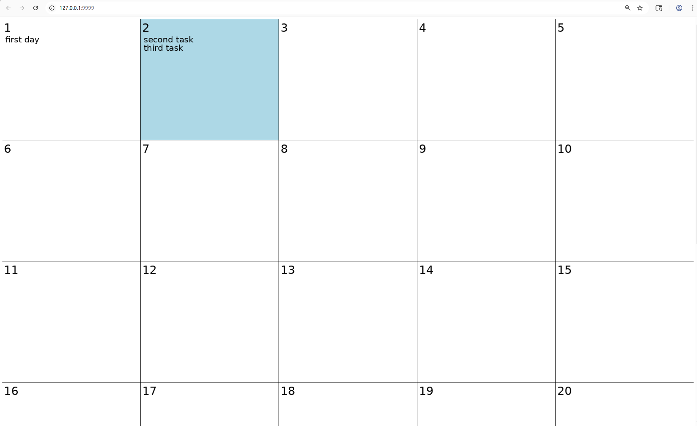
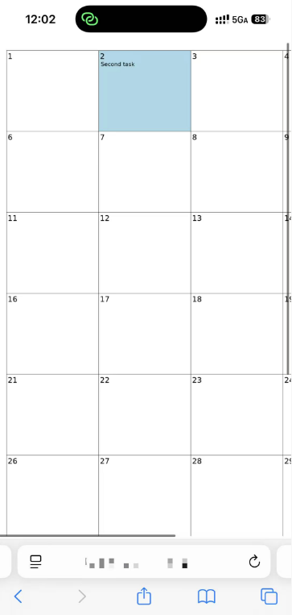
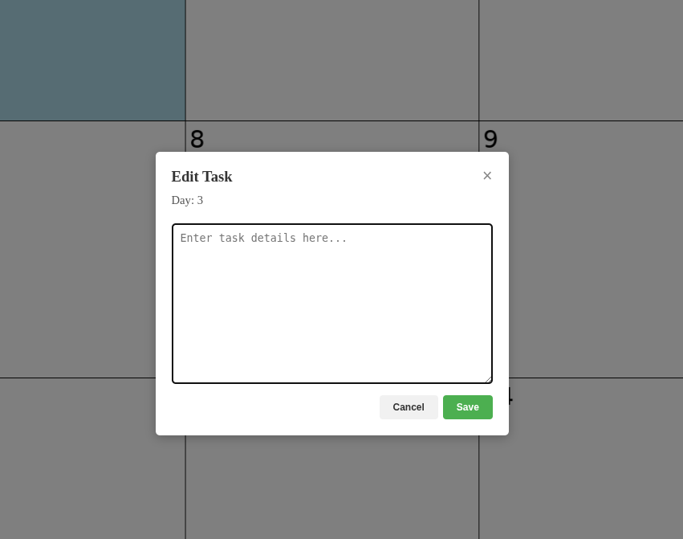
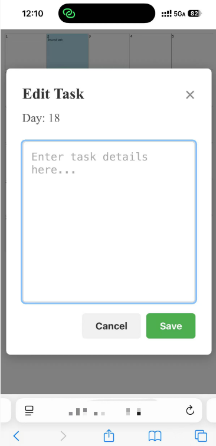

**1.Install** 
pip install flask Pillow 
python app.py 
**2.Principle** 
I creat 30 file on static/task which storage task data 
Function create_calendar_with_task() will draw calendar,show today with blue. Then read that file and write task in calendar. 
If clicked in one day, js will show text editor and you can edit task. Then push save button to save task and redraw Calendar.png and reload the web page. 
**3.Use** 
This is a personal calendar. 
You can plan this month task on calendar. 
It looks like this. 
 
You can use on computer also in Phone. 
 
Click the day and you can edit task. 
 
